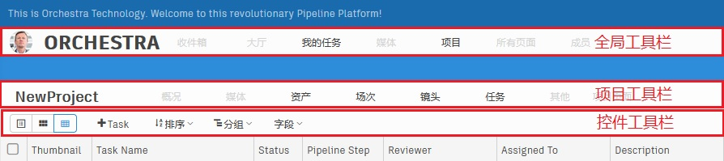

# 基础知识

围绕视效流程的工作劳神费力，要达到工业品质，还要在堆积如山的需求和捉襟见肘的工期之间闪转腾挪。看似纷繁复杂，但我们仍然能够从中提炼出一些最普遍的概念，例如项目、工序、任务、版本、文件等等。充分理解这些概念能帮助我们更好地安排工期，简化流程，做出决策。  
Orchestra Pipeline System的设计也沿用了这一系列概念，理清这一系列概念，将有助于您更好地使用我们的产品。  
 

以下是我们在项目中经常接触到的概念。  
 

#### 实体类型(Entity Type)  
*实体类型*一般指代可以区别开的事物类型，一个实体类型就是一种概念，比如*书籍*与*语言*就是两个不同的实体类型，*镜头*与*场次*也分属两个不同的概念，所以也不是同一个实体类型。实际上实体类型就是一类数据对象，在数据库中体现为*表*。  
实体类型是Orchestra Pipeline System中最基本的概念，*镜头(Shot)*是实体类型，*工序(Step)*是实体类型，*任务(Task)*是实体类型，*页面(Page)*也是实体类型，甚至*实体类型(Entity Type)*本身也是一个*实体类型*。  

#### 实体(Entity)  
*实体*一般指代*实体类型*的具体体现，每一类*数据对象*的个体就可以称为*实体*。在数据库中，实体体现为*表*中的一条*记录*。  
*实体*是Orchestra Pipeline System中最常用的概念，我们可以称Shot页面中的*spo_010_0001*为一个实体，也可以称Asset页面中的*Tree*为一个实体。  

#### 字段(Field)
我们用包含了哪些*字段*来区分不同的实体类型，用*字段*的值来区分实体。  
实际上*字段*与数据库中的*column*是相同的概念。
*字段有*一个最重要的属性即*数据类型(data_type)*，这个属性会决定这个字段怎样处理数据，以及前端页面如何显示此数据。
数据类型是*布尔型(boolean)*的字段接收true或false，数据类型是*时长型(duration)*的字段只接收数字，默认单位是*小时(hour)*。

#### 任务(Task)
任务是一种特殊的实体类型，在工作中，我们经常会把某一工序对应的一件具体的工作称为任务。   
举个例子，视效项目一般都有模型、材质、绑定等工序，根据这些涉及的工序，我们可以为资产Tree创建Tree_Model，Tree_Material，Tree_Rig等任务。  

工序与任务的区别在于，任务是工序的具体化，任务可以分配给具体的艺术家，可以追踪*开始时间*、*结束时间*，可以通过*甘特图*进行编辑，可以在*看板(Kanban)*中修改*任务状态*。  

#### 版本(Version)  
版本记录了某项工作的迭代信息，版本会关联到具体的实体与任务上。    
在视效项目中，版本需要上传一个视频供媒体播放器预览。  
您也可以根据项目情况把序列路径和发布文件的信息保存在版本中。  

#### 流程(Pipeline)
流程特指一套相互之间存在依赖关系的工序。在Orchestra Pipeline System中，流程会以*有向非循环图(DAG)*的方式呈现，图中每一个节点就是一道工序。上游工序结束时，下游工序将收到通知。您在创建镜头时如果选择了流程，Orchestra会根据该流程为镜头创建一系列任务。  
Orchestra中默认提供了character、prop、set、animation_shot、live_action_shot_without_asset等流程。

#### 工序(Step)
工序就是*分工*，完成一个工业级镜头通常需要多人分工进行，工序之间存在时间先后顺序。  

#### 流程配置(Pipeline Config)
在Orchestra Pipeline System中，流程配置就是制作的规范，一个项目一般会有多支制作团队参与，每支团队通常都有各自的内部规范和工具，在这种情况下，在团队之间交接工作就成了难题。  
为在各个团队的流程配置之间建立起映射关系，Orchestra针对这种情况推出了*流程配置*功能。  
*流程配置*几乎可以覆盖大部分视效制作的规范，每个团队都可以定义自己的流程配置，以确保这些差异能得到明文的管理。
  
#### 页面(Page)
Orchestra中包含多种页面。其中有设置页面，登录页面，回收页面等等，我们最常用的页面是数据页面。  
数据页面包含以下几类：详情页面，缩略图页面，表格页面。  
- 详情页面只显示单个实体的信息。该页面包含两个区域，即上方的基础信息，和下方的标签页信息。
  - 基础信息包含该实体类型的常用字段，比如名称、描述、状态等。在之后的版本中您可以自定义该区域显示的字段。  
  - 标签页区域则由多个与当前实体相关的标签页组成。Task实体的标签页会包含Message、Task Info、Versions、Publishes四个标签页，分别显示与当前Task相关的批注信息、任务详情、所有版本、所有发布文件。  
- 缩略图页面以缩略图的形式显示多个实体的信息，双击缩略图可以快速跳转详情页面。
- 表格页面以甘特图及表格的形式呈现多个实体的数据，该页面提供了最为丰富的编辑功能，使得用户能够精细地把控项目。  

*Orchestra Pipeline System是数据驱动的项目管理软件，每一张Web页面都对应一个Page实体，Page实体保存着这个页面的相关设置。比如Shot页面应该显示Shot实体，页面中应显示哪些字段，每页显示多少数据，默认显示第几页等等。  
您在创建新的实体类型的时候，会有**是否创建页面**的勾选项。*  

#### 工具栏(Toolbar)
Orchestra中的工具栏主要分三类，一类是全局工具栏，一类是项目工具栏，一类是控件工具栏。
全局工具栏的上下文(Context)设置为全局。
项目工具栏的上下文(Context)设置为当前页面(Page)所属的上下文。
控件工具栏的上下文(Context)是由所属控件决定的，可以是当前页面所属的上下文，也可以是自定义的上下文。  

#### 上下文(Context)  
Orchestra的页面的上下文一般由用户(Human User)、项目(Project)、上游实体(upstream entity)组成。  
