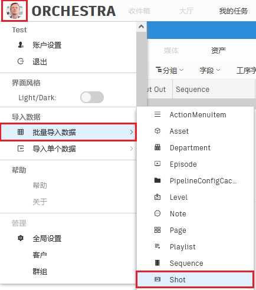
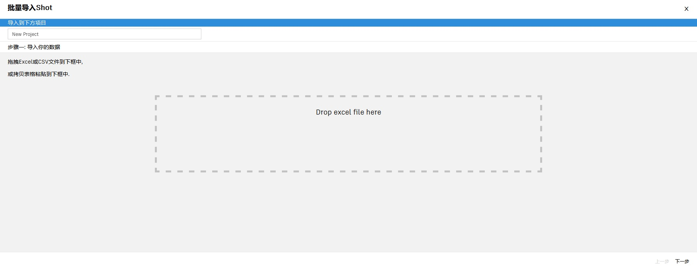
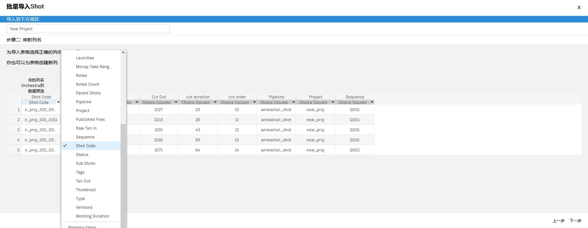
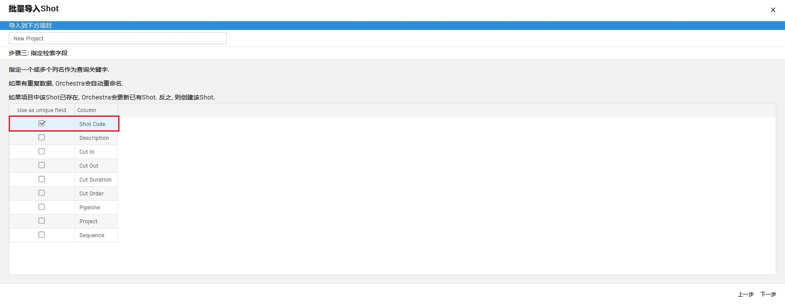
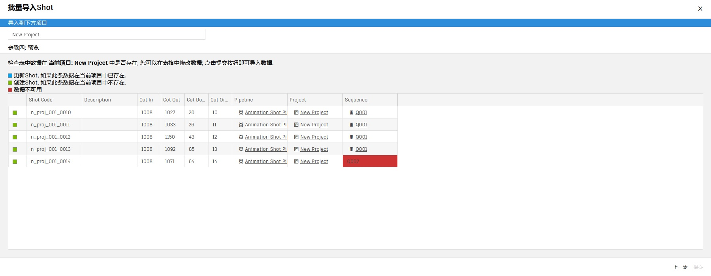

# 导入EXCEL文件，批量创建镜头

在视效项目中，一个场次(Sequence)由一系列镜头(Shot)有序组成，单个镜头往往包含镜头号、时间出入点等剪辑相关字段。

Orchestra Pipeline System提供了三种创建镜头的方法：
-   [创建单个镜头](SHOT.md)
-   [批量创建镜头(EXCEL)](BULK.md)
-   [批量创建镜头(EDL)](EDL_BULK_SHOT.md)  
 

视效公司在承接外包工作的时候，一般会收到剪辑好的原始镜头序列，以及一份如下的excel文件：

<table>
    <tr>
        <th>code</th><th>description</th><th>cut in</th><th>cut out</th><th>cut duration</th><th>cut order</th><th>project</th><th>sequence</th>
    </tr>
    <tr>
        <td>s0010</td><td>just test</td><td>1008</td><td>1029</td><td>22</td><td>1</td><td>n_proj</td><td>Q001</td>
    </tr>
</table>

这份excel文件记录了镜头序列的名称、描述、剪辑帧出入点、剪辑帧长、剪辑次序、项目以及场次。  
您还可以向excel文件添加pipeline信息，这样Orchestra会自动为每个镜头自动创建相关任务。   
添加pipeline字段后，excel内容如下：
<table>
    <tr>
        <th>code</th><th>description</th><th>cut in</th><th>cut out</th><th>cut duration</th><th>cut order</th><th>project</th><th>sequence</th><th>pipeline</th>
    </tr>
    <tr>
        <td>s0010</td><td>just test</td><td>1008</td><td>1029</td><td>22</td><td>1</td><td>n_proj</td><td>Q001</td><td>animation_shot</td>
    </tr>
</table>    
    
Orchestra Pipeline System提供了通过excel文件批量创建镜头的方式，您可以此功能快速的录入镜头，节约宝贵的制作时间。   
 

-   #### 点击**全局工具栏**左侧的**综合按钮**，在**综合菜单**中点击**导入数据-批量导入数据-Shot**菜单项，打开**批量批量创建器**。   
      

-   #### 拖拽excel文件到**Drop excel file here**区域  
      

-   #### 点击**Choice Column按钮**，逐个映射字段  
      
    *说明：  
    Orchestra Pipeline System需要用户自行指定excel与Orchestra之间的字段对应关系，以确保Orchestra能正确地录入excel中的数据。*

-   #### 指定检索字段    
    选择一个字段作为检索字段，Orchestra Pipeline System会根据该字段的值判断excel的数据在系统中已存在，在这里我们选择**镜头代号(Shot Code)**作为检索字段。  
      
    *说明：  
    **镜头代号(Shot Code)**的identifiable属性为真，会被系统认定为身份验证字段，请尽量确保该字段值全局唯一。*   

-   #### 预览数据，修改数据  
    这是提交表单前的最后一步，请确认数据无误。
    Orchestra Pipeline System会自动检验即将提交的数据，无法识别的实体类型字段会以红色高亮显示，双击该单元格即可修改该数据。  
      
    *说明：  
    Orchestra Pipeline System需要用户自行指定excel与Orchestra之间的字段对应关系，以确保Orchestra能正确地录入excel中的数据。*

-   #### 点击**提交(Submit)**按钮，完成创建  