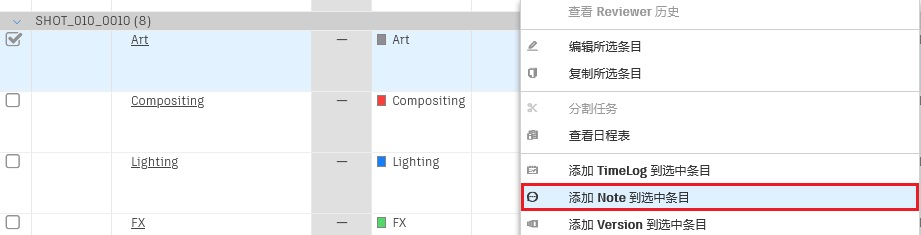
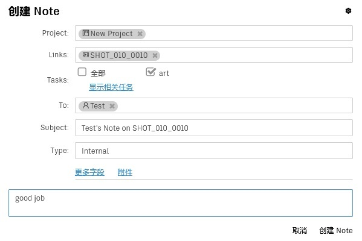
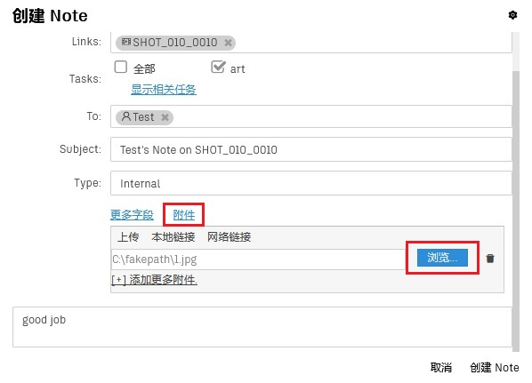
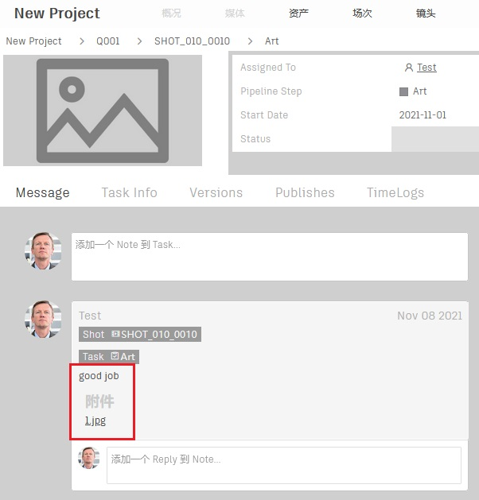
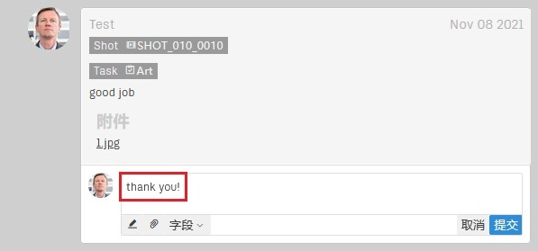

# 批注任务，回复批注

您可以通过批注(Note)反馈意见，也可以通过回复(Reply)来回应批注。
在稍后开放的Inbox功能中，您可以浏览发送给您的批注和回复。

   

-   #### 进入任务页面，选中自己的任务，点击鼠标右键打开菜单，点击“添加Note到选中条目”
    

-   #### 填写表单  
      

-   #### 添加附件，点击创建按钮，提交表单
      

-   #### 进入该任务的详情页面，点击Message标签页即可查看刚才发送的批注  
      
    *说明：*  
    *点击链接即可查看附件*

-   #### 回复批注  
    点击批注下方的输入框即可回复批注  
      
    当然您也可以在回复中添加附件  
