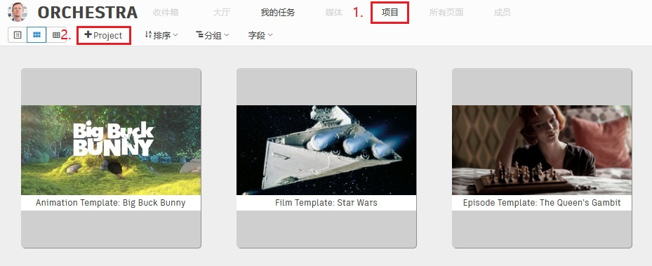
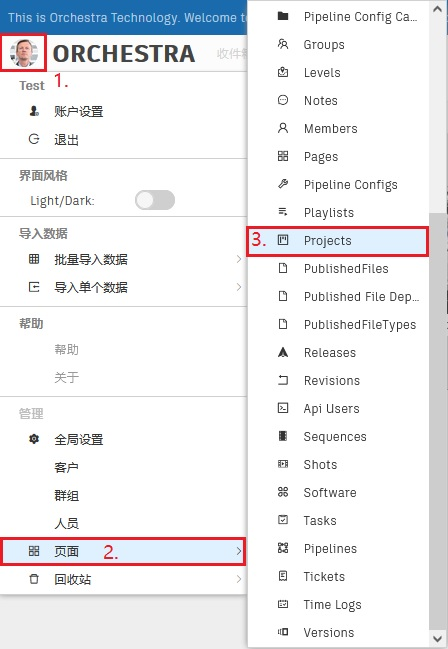
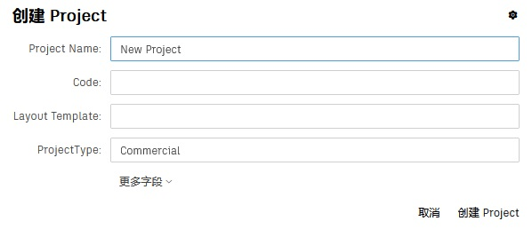
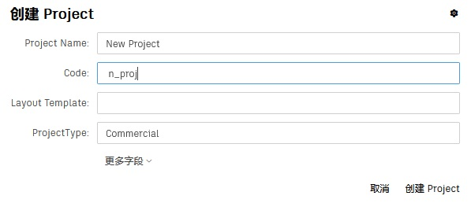
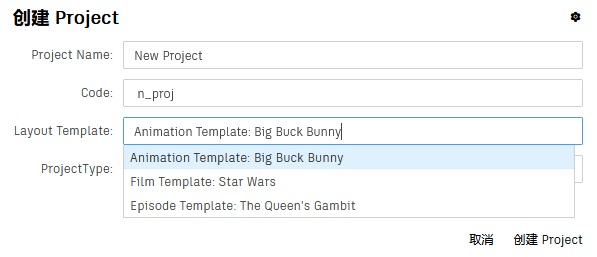
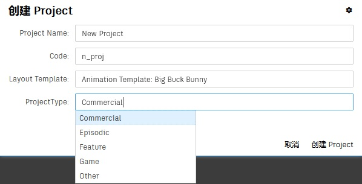
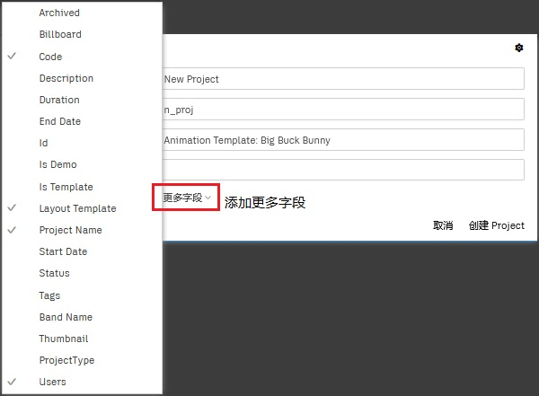
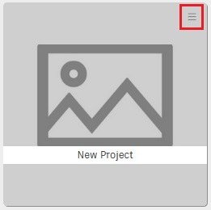
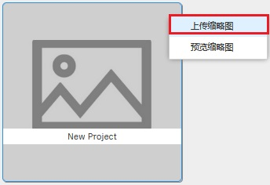

# 创建一个项目

项目(Project)在视效工作中一般处于最上面的层级，在这里我们首先创建一个项目。  

-   #### 打开创建项目表单

    方法一：
    1. 点击**全局工具栏**中的项目按钮，进入项目页面。  
    2. 点击**控件工具栏**中的**创建按钮**，打开**创建表单**。  

      

    方法二： 
    1. 点击**全局工具栏**左侧的**综合按钮**，打开**综合菜单**。   
    2. 点击**导入数据-导入单个数据-Project**菜单项，打开**创建表单**。  

      

-   #### 在表单中填写**项目名称(Project Name)**  

    

-   #### 在表单中填写**项目代号(Code)**

    在 Orchestra Pipeline System 中，大部分实体类型都有*代号(code)*字段，顾名思义，代号应当简洁、含义明确、有区分度，方便我们快速地识别当前实体。  
       
    _说明：部分**代号(code)**要求字段值必须**全局唯一**。_

-   #### 在表单中选择**项目模板(Layout Template)**

    新建项目将会继承项目模板的流程(Pipeline)、页面(Page)、层级导航(Bread Crumb)。

      
     _说明：Orchestra Pipeline System 提供了默认的项目模板：_

    -   _Animation Template: Big Buck Bunny 是针对动画项目的模板；_
    -   _Film Template: Star Wars 是针对电影项目的模板；_
    -   _Episode Template: The Queen's Gambit 是针对电视剧的模板。_

    _我们还将继续增加新的项目模板。_

-   #### 在表单中选择**项目类型(Project Type)**

      
    _说明：该字段是**列表型字段**，默认值为 Commercial。_

-   #### 在表单中填写其他字段，此步可跳过。

    点击*更多字段*按钮，即可设置更多字段。  
     

-   #### 点击表单中的**创建 Project**按钮，完成创建

    (图略)

-   #### 在项目页面的详情分页中找到新创建的项目，为它添加缩略图
      
      
    
    
   
以上就是创建一个项目的快速方法，之后您还可以在**Project 详情页面**做更多设置。
