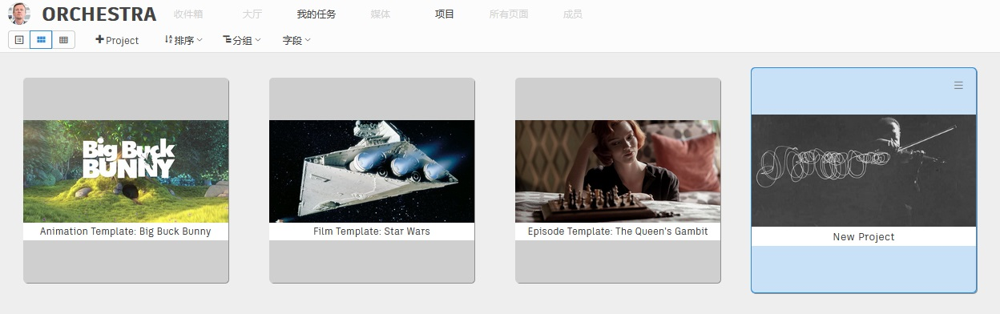
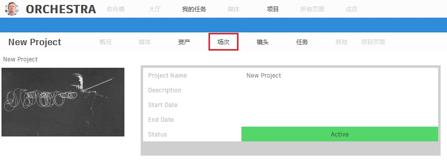
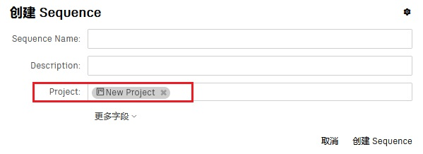
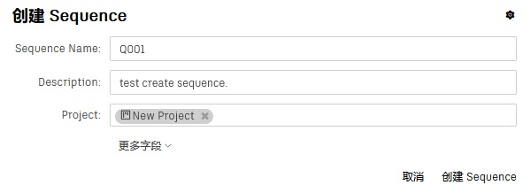

# 创建一个场次

一个项目会涉及多个场次，在视效工作中，一个场次即一段故事连续的剧情。

-   #### 进入新项目的详情页面
    在Project页面中双击之前创建的New Project，即可进入该项目的详情页面。  
      

-   #### 进入场次(Sequence)页面  
    点击项目导航栏的Sequence按钮即可进入场次(Sequence)页面。
      

-   #### 点击项目工具栏上的创建按钮，打开场次表单
      
    
    _说明：我们会发现表单已经自动填入了项目信息。这就是项目工具栏与全局工具栏的不同之处。_

-   #### 填写**序列名称(Sequence Name)**与**描述(Description)**，点击**创建Sequence**按钮，完成创建
    