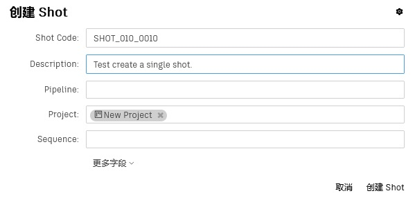
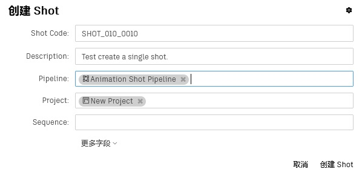
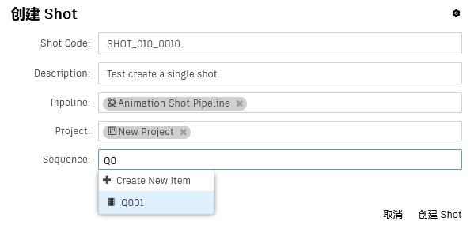

# 创建一个镜头

在视效项目中，一个场次(Sequence)由一系列镜头(Shot)有序组成，单个镜头往往包含镜头号、时间出入点等剪辑相关字段。

Orchestra Pipeline System提供了三种创建镜头的方法：
-   [创建单个镜头](SHOT.md)
-   [批量创建镜头(EXCEL)](BULK.md)
-   [批量创建镜头(EDL)](EDL_BULK_SHOT.md)  
 

下面介绍创建单个镜头的方法：
-   #### 点击项目工具栏上的镜头(Shot)按钮，进入镜头页面  

-   #### 点击控件工具栏上的创建镜头按钮，打开镜头表单  

-   #### 依次填写镜头代号(Shot Code)和描述(Description)
    

-   #### 选择流程(Pipeline)
    
    *说明：  
    此处选择的**Animation Shot Pipeline**流程包含了**Layout**, **Animation**, **Simulation**, **Crowds**, **Simulation**, **Crowds**, **FX**, **Lighting**, **Compositing**等工序*。

-   #### 填写场次(Sequence)
    
    *说明：  
    场次(Sequence)字段是一个实体字段，实体字段只需要输入两个字符就能显示名称包含这个两个字符的实体。*

-   #### 点击**创建镜头(Shot)**按钮，完成创建  