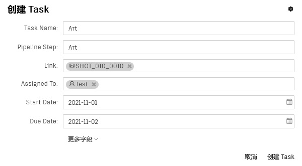

# 创建一个任务

任务(Task)指代一项具体的工作，您可以将这项任务分配给具体人员去完成。

Orchestra Pipeline System提供了三种创建任务的方法：  
1. [创建 Shot 的时候设置 pipeline 字段](SHOT.md)
2. [进入镜头页面，选择镜头并点击鼠标右键，在弹出菜单中点击“添加Task到选中条目”选项](TASK_BY_SHOT.md)  
3. [进入任务页面，点击项目工具栏上的创建任务按钮](TASK.md)  

 
下面介绍第三种创建任务的方式。  

-   #### 点击项目工具栏上的任务(Task)按钮，进入任务页面  

-   #### 打开任务表单
    

-   #### 填写**任务名称(Task Name)**，该字段推荐与**流程工序(Pipeline Step)**保持一致  
    填写**流程工序(Pipeline Step)**  
    填写**链接(Link)**名称，在这里既可以是**镜头(Shot)**也可以是**资产(Asset)**  
    填写**开始时间(Start Date)**  
    填写**结束时间(Due Date)**  
    

-   #### 点击**创建任务(Task)**按钮， 完成创建。
