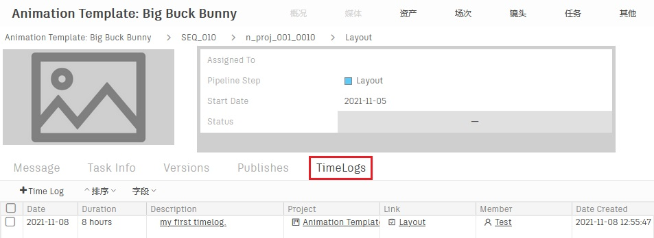

# 提交时间日志(Timelog)

您可以通过时间日志(Timelog)记录每一位艺术家的工时，更准确地了解团队的工作强度，以便协调项目进度。

   

-   #### 进入任务页面，选中自己的任务，点击鼠标右键打开菜单，点击创建Timelog
    

-   #### 填写表单，点击创建按钮，提交表单  
    *说明：*  
    *Date：工作日期，即当天。*  
    *Duration：工作时长，以小时为单位。*  
    *MemBer：工作人员，一般填写自己。*     
      

-   #### 查看刚才选中的任务，您的时间日志增加了8个小时。
      

-   #### 您可以在该任务的详情页面中找到Timelog的标签页，查看该任务全部的Timelog
      