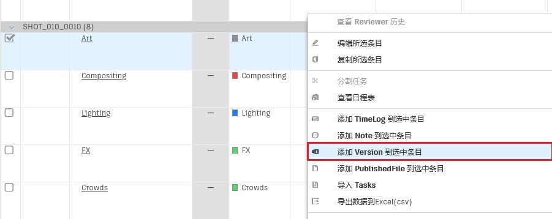
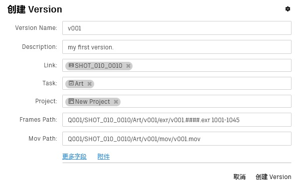
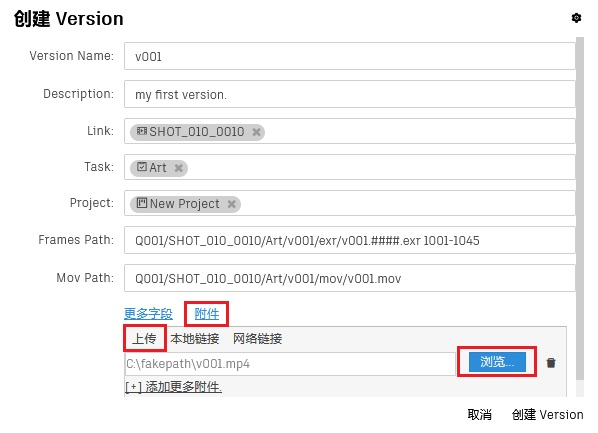
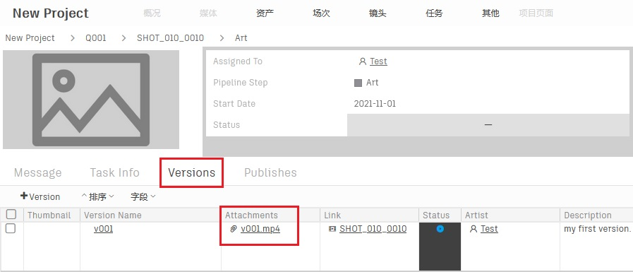
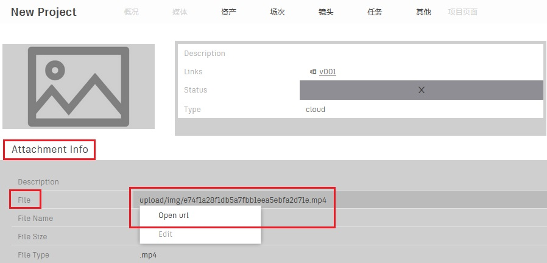

# 发布一个版本

不同公司发布版本的方式都各有千秋，而版本的字段又相对较多，所以版本会有多种用法，以下是Orchestra团队推荐的使用版本的方法。

   

-   #### 进入任务页面，选中自己的任务，点击鼠标右键打开菜单，点击创建版本
    

-   #### 填写主要信息
    

-   #### 点击附件按钮，在上传标签页中点击浏览按钮，上传文件
    ##### 流媒体文件会自动转码成hevc编码，供视频回放工具使用，目前支持mov、mp4、avi三类流媒体文件的转码，后续我们将支持更多格式
    

-   #### 您可以通过点击图中链接跳转到Art任务的详情页面，在Versions标签页中查看新创建的版本  
    想要查看新版本的附件，可以点击图中附件  
      
    然后跳转到附件(Attachment)详情页面，点击红框中的File字段唤出菜单，就可以查看附件了。  
      
    *说明：*   
    *附件都保存在对象存储服务器orchestra-oss.com中，只有通过api生成的签名链接才能访问附件，杜绝了文件泄密的可能。*
    *目前orchestra-oss.com还在测试运营中，欢迎大家提出宝贵的意见。*